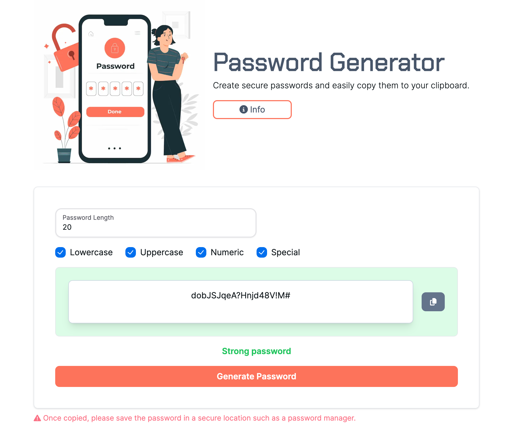

# Password Generator

## Table of contents

- [Overview](#overview)
- [Instalation](#installation)
- [Application Screenshot](#application-screenshot)
- [Links](#links)
- [Built with](#built-with)
- [Useful resources](#useful-resources)
- [Authors](#authors)
- [Acknowledgments](#acknowledgments)

## Overview

Password Generator is a simple password generator tool that I created for friends and family who needed a little extra help with securing their online presence.


## Application Screenshot



## Links

Visit my deployed application here:

[Password Generator](https://www.passwordmanager.org.uk)


## Built with...

[NextJS](https://nextjs.org/)

[Tailwind CSS](https://tailwindcss.com/)   


## Useful Resources

[NextJS Documentation](https://nextjs.org/docs)

 [React Documentation](https://react.dev/)
 
 [Tailwind CSS Documentation](https://tailwindcss.com/docs/installation)

## Authors

[Marc Norris](https://github.com/shaky411)  
 
## Acknowledgments


   
## Installation

First, install all of the dependancies:
```bash
npm install or npm i
```

Then, run the development server:

```bash
npm run dev
# or
yarn dev
# or
pnpm dev
# or
bun dev
```

Open [http://localhost:3000](http://localhost:3000) with your browser to see the result.

This project uses [`next/font`](https://nextjs.org/docs/basic-features/font-optimization) to automatically optimize and load Inter, a custom Google Font.
